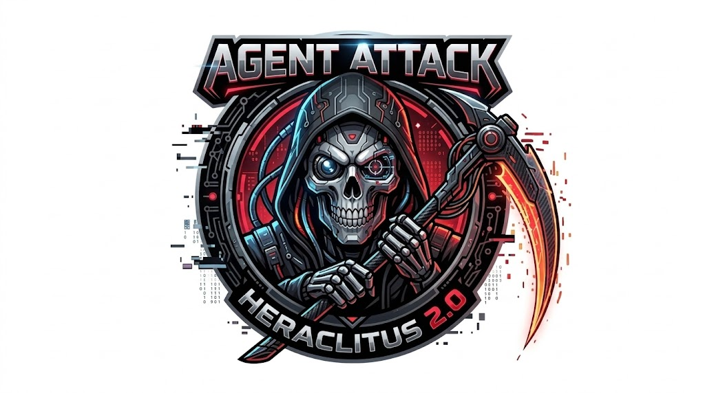

<p align="center">
  
</p>
# Agent-Atack-Heraclitus 2.0

Laboratório de *red team* defensivo e agêntico para o HeraclitusDB de
desenvolvimento/pré-produção, com alvo local ou em uma rede privada de teste.
Ele executa ataques simulados com
dados sintéticos antes do banco entrar em produção, mantém uma suíte
determinística de regressão e permite que
agentes LLM proponham variações novas. O daemon 24/7 nunca recebe shell. Em uma
execução manual explícita, a **Arena Autônoma** entrega Bash livre ao modelo
dentro de namespaces descartáveis: clone tmpfs local ou relays para um único IP
privado de laboratório. O modelo pode descobrir candidatos, mas não julga o
próprio resultado.

> Use somente em uma instância sua ou para a qual você tenha autorização
> explícita. O runner padrão recusa destinos fora do loopback; o perfil remoto
> aceita somente IP privado literal e portas na allowlist exata da campanha.

## O que mudou em relação ao projeto original

- papéis separados de `Recon`, `Planner`, `Critic`, `Mutator` e `Minimizer`;
- `AttackPlan` JSON tipado e validado antes de qualquer I/O;
- ferramentas fixas (`http_request`, `mcp_call`, `tcp_probe` e contador
  sintético), sem `eval`, shell ou subprocesso;
- oráculos determinísticos independentes do LLM;
- uma fronteira de política descarta `oracle_ids` e metadados de veredito
  sugeridos pelo modelo e reaplica o contrato do teste curado;
- o risco efetivo é inferido da operação: `POST`, `PUT`, `PATCH` e `DELETE` não
  viram seguros apenas porque o modelo marcou `risk=safe`;
- uma falha só vira `VULNERABLE` depois de três reproduções com a mesma
  evidência tipada;
- respostas do banco e memórias são delimitadas como dados não confiáveis;
- credenciais são injetadas por código confiável depois do gate de segurança e
  nunca aparecem no plano ou no prompt;
- eventos finais são persistidos no log append-only do próprio HeraclitusDB;
- daemon `systemd --user` para o perfil smoke 24/7;
- arena Bubblewrap com shell Linux arbitrário, root interno sem capabilities,
  filesystem tmpfs e rede isolada;
- modo remoto `Linux/Windows → WSL/Linux` por IP privado exato, token efêmero e
  relays por porta que não permitem varrer a rede;
- roster multi-provider com Codex/OpenAI, Claude, Gemini e modelos locais;
- catálogo de 28 famílias, incluindo verdade temporal, WAL/crash, Raft,
  TOCTOU, multi-tenant, memória persistente, parser differential e auditoria;
- logs coloridos e explicativos no estilo do boot do Fedora.

## Semântica do log

| Estado | Significado |
|---|---|
| `OK` | O ataque não funcionou e o oráculo comprovou o invariante; em probes diagnósticos, a mensagem diz apenas o que foi observado. |
| `VULNERÁVEL` | O ataque funcionou e a mesma violação foi reproduzida. |
| `INCERTO` | Faltou pré-requisito ou evidência; nunca conta como aprovação. |
| `FALHA` | Houve violação ainda não reproduzida de forma estável. |
| `ERRO` | O laboratório falhou; isso não prova falha do banco. |

## Instalação no WSL

```bash
cd /mnt/d/DEV/Agent-Atack-Heraclitus-2.0
python3 -m venv .venv
.venv/bin/python -m pip install -e '.[dev]'
sudo apt-get install bubblewrap
.venv/bin/heraclitus-attack doctor --config config/smoke.json
```

Executar uma campanha manual com cor:

```bash
FORCE_COLOR=1 .venv/bin/heraclitus-attack run --config config/smoke.json
```

Executar apenas os testes fixos, sem LLM:

```bash
.venv/bin/heraclitus-attack run --config config/smoke.json --no-agentic
```

O perfil padrão usa `MockProvider`, portanto o pipeline de seis agentes roda de
forma determinística e offline. Depois deles, uma fronteira não-LLM reaplica o
contrato de oráculo curado. Para um LLM vivo compatível com a API OpenAI,
altere `provider.kind` para `openai-compatible` e configure:

```bash
export HERACLITUS_LLM_BASE_URL=http://127.0.0.1:11434/v1
export HERACLITUS_LLM_MODEL=seu-modelo-local
export HERACLITUS_LLM_API_KEY='se-necessario'
```

Um endpoint remoto de modelo só é aceito por HTTPS. Mesmo assim, o prompt recebe
apenas metadados limitados e respostas do banco têm o texto removido.

## Arena autônoma com shell Linux

O comando abaixo cria um HeraclitusDB vazio dentro de tmpfs, monta somente o
binário, o catálogo e fontes selecionadas do projeto 1.0, e destrói todo o
estado ao terminar:

```bash
cd /mnt/d/DEV/Agent-Atack-Heraclitus-2.0
export HERACLITUS_ATTACK_DESTRUCTIVE_TOKEN='token-efemero-desta-janela'
FORCE_COLOR=1 .venv/bin/heraclitus-attack arena \
  --config config/arena.json \
  --snapshot-id clone-tmpfs-001 \
  --i-understand-isolated-shell
```

`config/arena.json` usa mock para uma demonstração offline. Para agentes vivos,
use `config/arena-multi-provider.example.json`, configure as três chaves e
substitua os IDs de modelo desejados:

```bash
export OPENAI_API_KEY='...'
export ANTHROPIC_API_KEY='...'
export GEMINI_API_KEY='...'
```

Os papéis com `roles` usam o provider indicado; o papel `arena-operator`, sem
rota exclusiva, alterna Codex, Claude e Gemini a cada ação. Trocar o modelo
desta conversa no Codex não é necessário e não configura automaticamente as
APIs do processo local.

## Atacante externo: Linux/Windows → WSL/Linux

Há duas topologias suportadas:

```text
mesma WSL:       Arena LLM → clone tmpfs HeraclitusDB
outra máquina:   Agent Attack Linux/Windows → relays exatos → WSL/Linux HeraclitusDB
```

Copie `config/remote-lab.example.json`, troque `192.168.56.20` pelo IP privado
da máquina-laboratório e mantenha esse mesmo IP em `allowed_remote_hosts` e em
todas as origens. Uma campanha remota é sempre manual:

```bash
export HERACLITUS_REMOTE_LAB_TOKEN='janela-remota-efemera'
export HERACLITUS_ATTACK_DESTRUCTIVE_TOKEN='clone-remoto-efemero'

.venv/bin/heraclitus-attack run \
  --config config/remote-lab.json \
  --i-understand-remote-lab \
  --remote-run-id laboratorio-2026-09-20 \
  --snapshot-id snapshot-descartavel-42
```

Para dar Bash livre aos agentes externos e ainda restringir a saída ao único
alvo, use `arena` com a mesma configuração remota e os dois reconhecimentos. A
arena continua sem interface de rede externa; seis proxies Unix/TCP controlados
pelo processo pai alcançam somente os endpoints declarados.

Credenciais do HeraclitusDB são opcionais e lidas somente no momento da
execução:

```bash
export HERACLITUS_AGENT_TOKEN='...'
export HERACLITUS_CORE_USERNAME='...'
export HERACLITUS_CORE_PASSWORD='...'
```

Sem elas, vetores que exigem autenticação ficam `INCERTO`; não produzem um falso
`PASS`.

Qualquer plano cuja semântica possa alterar estado exige `--snapshot-id` e o
token efêmero `HERACLITUS_ATTACK_DESTRUCTIVE_TOKEN`, mesmo que o JSON do plano
declare risco baixo. As únicas exceções `POST` do serviço smoke são JSON
deliberadamente inválido e a ferramenta sintética negada com marcador fixo.

## Serviço 24/7

```bash
mkdir -p ~/.config/systemd/user
mkdir -p ~/.config/heraclitus-attack
cp config/agent.env.example ~/.config/heraclitus-attack/agent.env
chmod 600 ~/.config/heraclitus-attack/agent.env
cp deploy/systemd/heraclitus-attack-agent.service ~/.config/systemd/user/
systemctl --user daemon-reload
systemctl --user enable --now heraclitus-attack-agent.service
```

Ver o status e acompanhar o log colorido:

```bash
systemctl --user status heraclitus-attack-agent.service --no-pager -l
SYSTEMD_COLORS=1 journalctl --user -fu heraclitus-attack-agent.service -o cat
```

O serviço executa somente `smoke`, com intervalo padrão de cinco minutos.
Campanhas destrutivas são recusadas pelo daemon e exigem execução manual,
snapshot descartável e token efêmero.

## `heraclitus top` detecta os testes?

O `heraclitus top` consulta eventos persistidos em
`/api/v1/agent/red-team/events` e pode mostrar as campanhas registradas. Ele não
é um IDS e não cria nem classifica ataques sozinho. Este projeto executa os
testes, aplica os oráculos e grava os resultados; `top` é a visão operacional
complementar:

```bash
cd /mnt/d/DEV/HeraclitusDB
./target/release/heraclitus top
```

## Testes

```bash
.venv/bin/python -m pytest -q
```

A CI testa Python 3.11, 3.12 e 3.13. A suíte cobre contratos de plano, bloqueio
de SSRF/credenciais/shell, limites, providers, ferramentas, oráculos,
reprodução, persistência e CLI.

## Documentação

- [Arquitetura](docs/ARCHITECTURE.md)
- [Matriz de ataques simulados](docs/ATTACK_MATRIX.md)
- [Arena autônoma](docs/ARENA.md)
- [Laboratório remoto Linux/Windows](docs/REMOTE_LAB.md)
- [Providers Codex, Claude, Gemini e locais](docs/PROVIDERS.md)
- [Modelo de ameaças](docs/THREAT_MODEL.md)
- [Runbook WSL/systemd](docs/RUNBOOK_WSL.md)
- [Política de segurança](SECURITY.md)

Relatórios JSON sanitizados ficam em `reports/`; a memória durável e auditável
continua sendo o HeraclitusDB.
